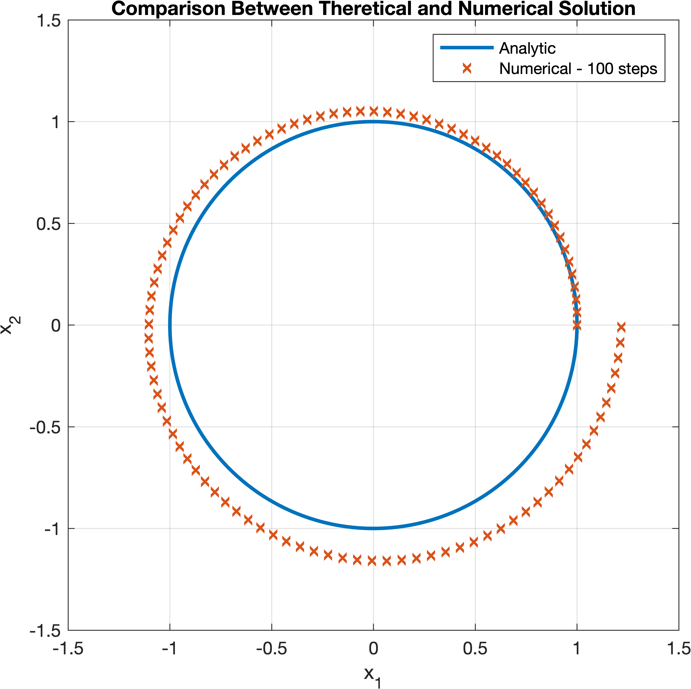

# ATP: Practical Sessions

List of the practical sessions discussed during the Advanced Transport Phenomena class.

## [PS1](ps1): Discretization of the Time Derivative

Solution of the ODE system of equations:

$$
\begin{cases}
  \dfrac{d x_1}{dt} = -x_2 \\
  \dfrac{d x_2}{dt} = x_1
\end{cases}
$$

* **Analytical Solution:** in parametric form $x_1 = \cos(t)$, $x_2 = \sin(t)$.
* **Metodology:** 1st order forward Euler approach for the discretization of the time derivative.
* **Key Test:** comparison between the numerical and analytical solution, and evaluation of the convergence rate at time $t = 2\pi$.

   
  

