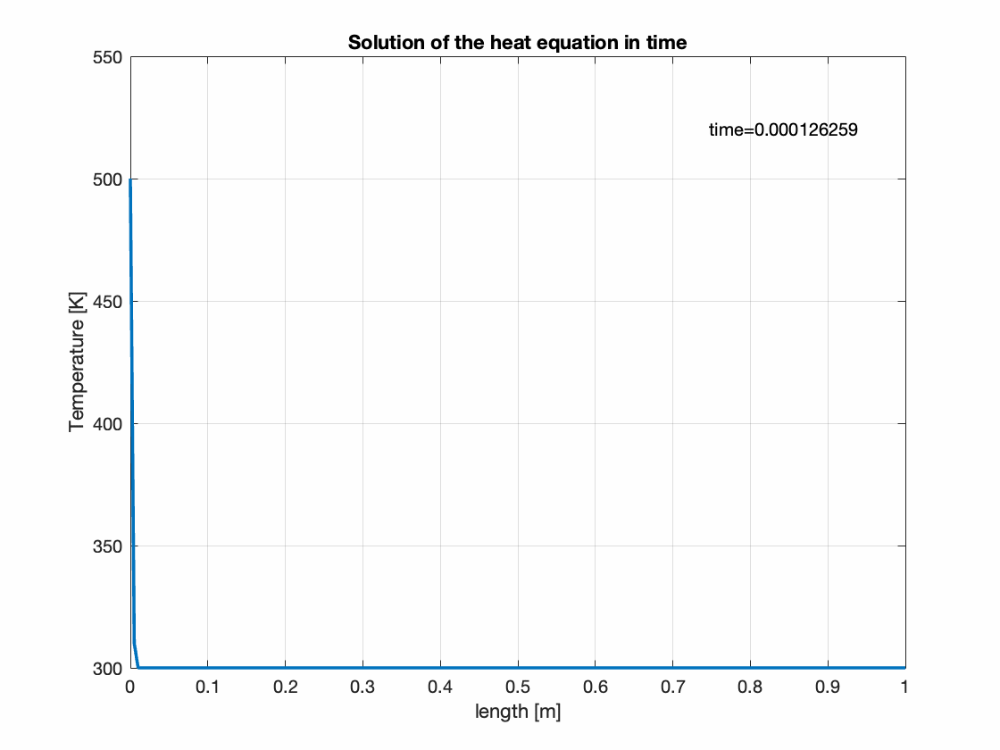

# ATP: Practical Sessions

List of the practical sessions discussed during the Advanced Transport Phenomena class.

## [Discretization of the Time Derivative](ps1)

Solution of the ODE system of equations:

$$
\begin{cases}
  \dfrac{d x_1}{dt} = -x_2 \\
  \dfrac{d x_2}{dt} = x_1
\end{cases}
$$

* **Analytical Solution:** in parametric form $x_1 = \cos(t)$, $x_2 = \sin(t)$.
* **Methodology:** 1st order forward Euler approach for the discretization of the time derivative.
* **Key Tests:** comparison between the numerical and analytical solution, and evaluation of the convergence rate at time $t = 2\pi$.

   
  

## [Solution of the Heat Equation](ps2)

Solution of the 1D Heat Equation with source term, for the evolution of the temperature field $T$ along a metal slab.

$$
  \dfrac{\partial T}{\partial t} = \alpha \nabla^2 T + \dfrac{\dot{q}}{\rho Cp}
$$

where $\alpha = \lambda/\rho/Cp$ is the thermal diffusion coefficient, assuming that the density $\rho$, heat capacity $Cp$, and thermal conductivity $\lambda$ are constant. The equation is integrated for a sufficiently long time until reaching the steady state. We assume an initial temperature of the metal slab, and Dirichlet boundary conditions for the left (hot) and right (cold) boundaries.

* **Methodology:** 1st order forward Euler approach for the discretization of the time derivative; 2nd order centered approach for the discretization of the diffusion term. The system is approximated both using both the [Finite Difference](ps2/diffusioneq_1D_FDM_explicit.m) and the [Finite Volume](ps2/diffusioneq_1D_FVM_explicit.m) discretization methods.
* **Key Tests:** differences between FDM and FVM, including the implementation of the boundary conditions. Effect of the introduction of a source term on the steady state solution. Importance of the choice of the time step for the stability of the system.

   
  

## [Solution of a Benchmark Advection-Diffusion Equation](ps3)

Solution of the 1D Advection-Diffusion equation for the transport of a sine wave.

$$
  \dfrac{\partial f}{\partial t} + \mathbf{u}\cdot\nabla f = \Gamma \nabla^2 f
$$

where the velocity field $\mathbf{u}$ and the diffusion coefficient $\Gamma$ are constant and uniform. The problem is initialized to the analytical solution, and periodic boundary conditions are used.

* **Analytical Solution:** $f(x,t) = A \sin(2\pi k (x - \mathbf{u}t)) e^{-4\pi^2k^2\Gamma t}$, where $A$ is the amplitude, while $k$ is the wave number.
* **Methodology:** 1st order forward Euler approach for the discretization of the time derivative. Comparison of 1st order and 2nd order approaches for the discretization of the convective term: BDS and CDS approximations for the finite difference case, Upwind and Centered approximations for the finite volume case. 2nd order centered approach for the discretization of the diffusion term.
* **Key Tests:** implementation of the problem using FDM and FVM, including the implementation of periodic boundary conditions. Testing the stability of the time discretization, and the behavior of the system at different velocity and diffusivity, with particular focus on pure convective conditions ($\Gamma = 0$).

   

## [Transport of a Discontinuity](ps4/advection_discontinuity_1D_FVM.m)

Solution of the 1D Advection equation:

$$
  \dfrac{\partial f}{\partial t} + \mathbf{u}\cdot\nabla f = 0
$$

for a step function $f$. In these conditions, the centered scheme leads to strong oscillations, while the upwind scheme leads to unphysical diffusion. We implement a possible solution to this problem.

* **Methodology:** 1st order forward Euler approach for the discretization of the time derivative. Comparison of 1st order upwind and 2nd order centered approaches for the discretization of the convective terms, in finite volumes. Implementation of flux limiters to switch between upwind and centered schemes depending on the local gradient of the function.
* **Key Tests:** comparison between centered, upwind, and flux limiter cases.

   

## [Time implicit solution of Advection-Diffusion equations](ps4/implicit_advection_diffusion_1D_FVM.m)

Solution of the 1D Advection equation:

$$
  \dfrac{\partial f}{\partial t} + \mathbf{u}\cdot\nabla f = \Gamma\nabla^2 f
$$

intialized as a Gaussian function:

$$
  f(x) = \dfrac{1}{\sigma \sqrt{2\pi}} \exp\left(-\dfrac{(x - \mu)^2}{2\sigma^2}\right)
$$

using a Dirichlet boundary condition for the right side of the domain $f(x=0,t) = 0$ and a Neumann boundary condition for the right side $\nabla f|_{x=L} = 0$.

* **Methodology:** 1st order backward Euler approach for the discretization of the time derivative. 1st order upwind approach for the discretization of the convective terms, 2nd order centered approach for diffusion term, using the FVM.
* **Key Tests:** verify that the solution is stable regardless the time step, and analyze the different solutions at varying Peclet number.

   

## [Iterative solution of Poisson Equations](ps5)

Solution of the 1D Poisson equation:

$$
  \nabla\cdot\left(\nabla f\right) = S
$$

where the the source term is constant and equal to 1, the left and right boundaries of the domain are prescribed with Dirichlet boundary conditions ($f_{left} = 0$, and $f_{right} = 1$).

* **Methodology:** Jacobi method, Gauss-Seidel, and Successive Over-Relaxation for the iterative solution of the problem. Discretization using the Finite Difference Method, using a centered 2nd order approach for the Laplacian operator.
* **Key Tests:** observe the different number of iterations required to reach convergence using Jacobi, Gauss-Seidel and the SOR methods (at different over-relaxation parameters $\beta$).

| Method  | $\boldsymbol{\beta}$ | iterations |
| ------- | ------- |----------- |
| Jacobi  | -  | 4043 |
| Gauss-Seidel |  - | 1982 |
| Gauss-Seidel + SOR | $\beta = 1.5$  | 667 |
| Gauss-Seidel + SOR | $\beta = 1.7$  | 355 |
| Gauss-Seidel + SOR | $\beta = 1.9$  | 128 |
| Gauss-Seidel + SOR | $\beta = 1.95$ | 244 |

## [Lid Driven Cavity](ps6/lid_driven_cavity_2D_FVM.m)

Solve the incompressible Navier-Stokes equations:

$$
\dfrac{\partial \mathbf{u}}{\partial t} + \mathbf{u}\cdot\nabla\mathbf{u} = \nu\nabla^2\mathbf{u} - \dfrac{1}{\rho}\nabla p + \mathbf{a}
$$
$$
\nabla\cdot\mathbf{u} = 0
$$

for an initially quiescient fluid in a square (2D) cavity, with lenght $L = 1 m$. The integration of the problem is performed for a sufficiently long time, until reaching the steady state. The east, west, and south walls of the domain are closed ($\mathbf{u} = 0$ and $\nabla p = 0$). The top wall (lid) moves with a given velocity $\mathbf{u} = (1,0) m/s$. The kinematic viscosity $\nu$ is adjusted depending on the simulation Reynolds number, whose initial value is $Re = 100$. Any other acceleration term $\mathbf{a}$ is neglected.

We want to find the velocity and pressure fields in every point of the domain.

* **Methodology:** Projection method for the pressure-velocity coupling. 1st order forward (explicit) Euler approach for the discretization of the time derivative. 2nd order centered approach for the discretization of the convective terms, 2nd order centered approach for diffusion term. Use the Finite Volume Method with a staggered grid.
* **Key Tests:** focus on the implementation technique, the different behavior of the system at different Reynolds number, and comparison with experimental data at different grid resolutions.

   

## [Flow in a Tube](ps7/flow_in_tube_2D_FVM.m)

Extend the lid driven cavity problem solving the same set of 2D incompressible Navier-Stokes equations but for the flow in a tube problem. The geometry of a 2D tube is a rectangle with width $L_x = 1 m$ and height $L_y = 8 m$. Initially, the kinematic viscosity is set to $\nu = 10^{-2}$, while the inlet velocity is $\mathbf{u}_{in} = (0.1,0) m/s$.

* **Methodology:** Compared to the lid driven cavity problem, this test case has different geometry and boundary condition. The top and bottom walls have _no-slip_ boundary conditons, the left wall considers the inlet fluid velocity, while at the right side we set _outflow_ conditions:
* **Key Tests:** Focus on the different boundary conditions for the pressure equation, and discuss the trend of the numerical results at different Reynolds numbers.

   

## [Heated Cavity](ps8/heated_cavity_2D_FVM.m)

Solve the incompressible Navier-Stokes equations coupled with the energy equation using the Boussinesq approximation:

$$
\dfrac{\partial \mathbf{u}}{\partial t} + \mathbf{u}\cdot\nabla\mathbf{u} = \nu_0\nabla^2\mathbf{u} - \dfrac{1}{\rho_0}\nabla p - \mathbf{g}\beta(T - T_0) 
$$
$$
\nabla\cdot\mathbf{u} = 0
$$
$$
\rho_0 c_{p,0} \left( \dfrac{\partial T}{\partial t} + \mathbf{u}\cdot\nabla T \right) = \nabla \cdot \left(\lambda_0\nabla T\right)
$$

for an initially quiescient fluid in a square (2D) cavity, with lenght $L = 1 m$. The temperature is imposed to constant values on the left (cold) and on the right (hot) walls, while the top and bottom boundaries are adiabatic.

We want to find the velocity, pressure, and temperature fields in every point of the domain.

* **Methodology:** Projection method for the pressure-velocity coupling. 1st order forward (explicit) Euler approach for the discretization of the time derivative. 2nd order centered approach for the discretization of the convective terms, 2nd order centered approach for diffusion term. Use the Finite Volume Method with a staggered grid. Buoyancy driven flows are included using Boussinesq approximation. 
* **Key Tests:** focus on the implementation technique, the different behavior of the system at different Rayleigh number, and compare the results with the numerical solution from the book by Ferziger & Peric (Computational Methods for Fluid Dynamics) at different grid resolutions.

   

