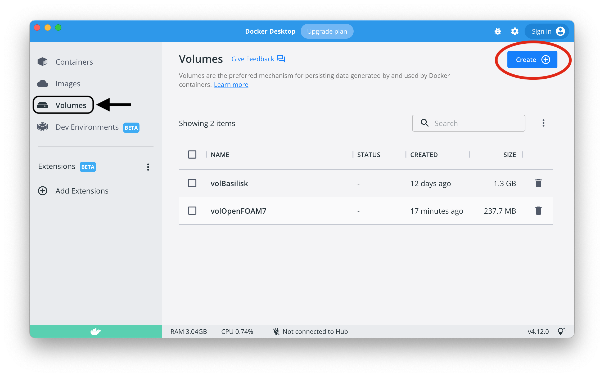
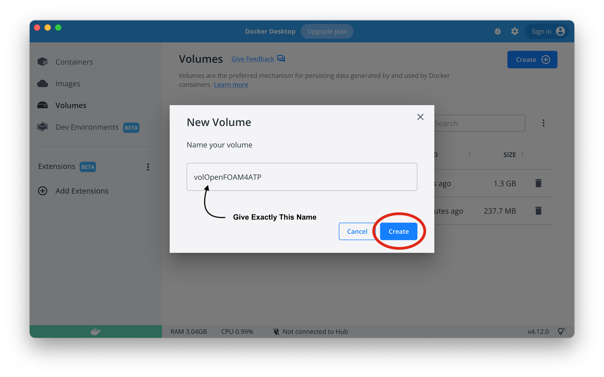
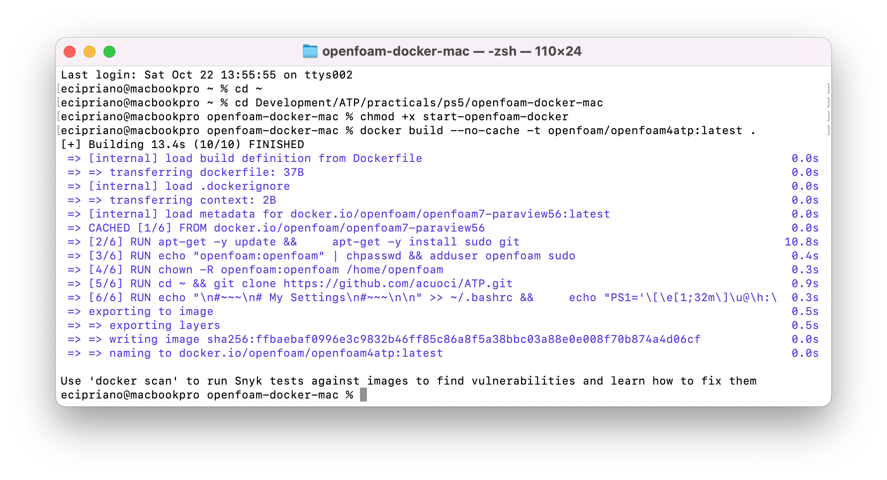
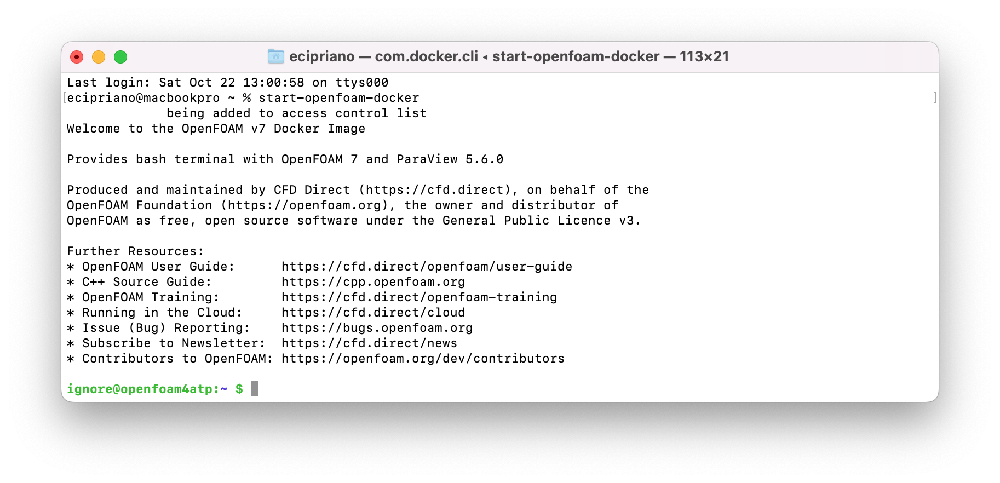

# OpenFOAM using Docker on MacOS
Instructions for the installation of OpenFOAM-9 via Docker using a MacOS.

## 1. Install Docker
The first step is the installation of [Docker](https://www.docker.com) from the official website.
Once Docker is installed, open it and make an account if required. Docker must remain open every time you want to use OpenFOAM using this procedure.

## 2. Create a Volume
Once you installed Docker, open it and click on the icon **Volumes** on the left. Then, click on the blue button **Create**, as in the following figure (ignore the presence of volBasilisk and volOpenFOAM7 in my computer).

As volume name write **volOpenFOAM4ATP** and create the volume.


## 3. Install XQuartz
On MacOS, Download and install [XQuartz](https://www.xquartz.org) from the official website. It is a software that allows graphical applications (i.e. Paraview, gnuplot, ecc) to be used from Docker containers. Also XQuartz must be open every time you want to use OpenFOAM using this procedure.

## 4. Download ATP Repository From GitHub
Search and open the app **terminal** which is installed by default in every MacOS systems. Launch the following commands in order to create a folder called **Development** in your home directory:
```
cd ~ && mkdir Development && cd "$_"
```
If `git` is installed in your system, clone this repository using the command:
```
git clone https://github.com/acuoci/ATP.git
```
Otherwise, open [this link](https://github.com/acuoci/ATP.git), click on the green button **Code** and **Download Zip**. Unzip the folder, re-name it into **ATP** and place it into the folder **Development** just created.

## 5. Install OpenFOAM4ATP Docker Image
Open **terminal** and launch the following commands:
```
cd ~
cd Development/ATP/practicals/openfoam-docker/openfoam-docker-mac
chmod +x start-openfoam-docker
``` 
Finally, build the image as:
```
docker build --no-cache -t openfoam/openfoam4atp:latest -f ../Dockerfile .
```
This operation must be performed just once. The output from these commands should look similar to the following figure but with a bunch of unreadable codes:



## 6. Update Environmental Variables
The file **start-openfoam-docker** contains the instructions to start openfoam using Docker. Add its path to your environmental variables using the following commands (assuming your terminal is using zsh, which is the default option):
```
echo "export PATH=~/Development/ATP/practicals/openfoam-docker/openfoam-docker-mac:$PATH" >> ~/.zshrc
source ~/.zshrc
```
Also this operation must be performed just once.

## 7. Run Container
Open a **terminal** and run the following command in order to be able to access an environment with OpenFOAM and everything needed to run and visualize the results.
```
start-openfoam-docker
```
From now on, whenever you need to access OpenFOAM through the Docker, just open **Docker** (wait for loading), open **XQuartz**, open the **terminal** app and run the command **start-openfoam-docker**.


## 8. Test
In order to test that everything was correctly installed, open a terminal and follow the instructions at Point 5 (Run Container). You will enter into an envirnoment where OpenFOAM is installed. Try to open the graphical application **Paraview** as follows:
```
paraview
```
Don't worry if the warning `QStandardPaths: XDG_RUNTIME_DIR not set, defaulting to '/tmp/runtime-ignore'`  is displayed.

If a new window with a graphical application opens up, then you made it! You can close the paraview window and quit docker with the command `exit`.

## Re-Installation Procedure
If after any update or problem you need OpenFOAM to be re-installed you should update the content of the ATP folder and repeat the instructions at Point 5.

## Common Problems
The following problems can be frequently encountered:
* **Docker daemon not running** - if you encounter the error `docker: Cannot connect to the Docker daemon at unix:///var/run/docker.sock. Is the docker daemon running?.` means that you did not open Docker.
* **Could not connect to any X display.** - if you encounter the error: `Could not connect to any X display.` means that you did not open XQuartz.
