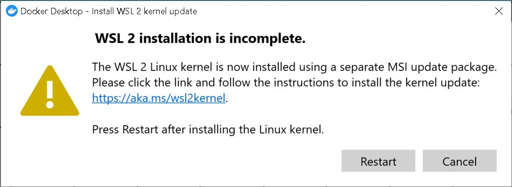
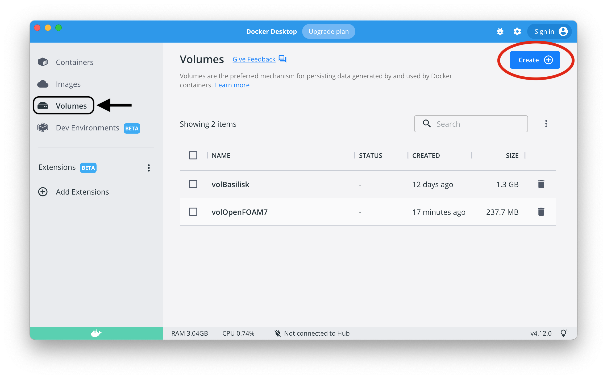
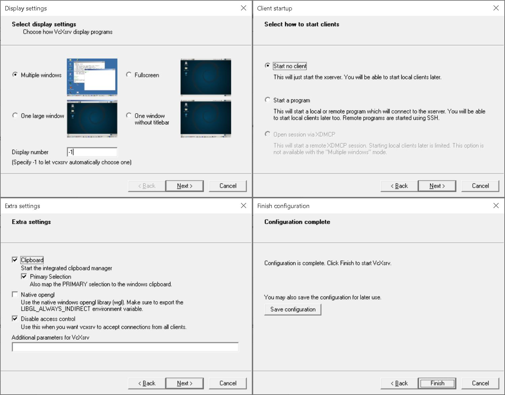
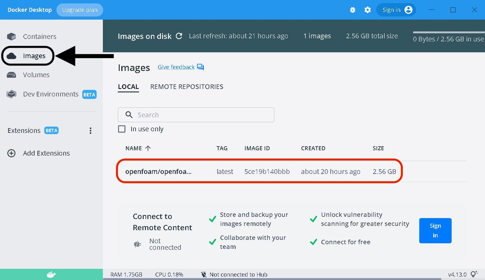
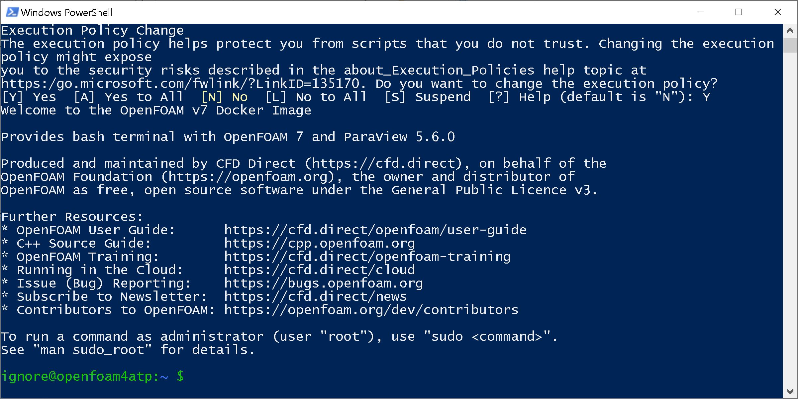

# OpenFOAM using Docker on Windows
Instructions for the installation of OpenFOAM-9 via Docker using Windows. On Windows two different installation processes can be used. The one reported here exploits Docker in order to use the same procedure for everyone (using mac or pc). Therefore, the instruction reported here is suggested, but if you prefer to use the [classical OpenFOAM installation procedure for Windows](https://openfoam.org/download/windows/) you can (consider that I may not be able to help you for problems specific to this installation procedure).

## 1. Install Docker
The first step is the installation of [Docker](https://www.docker.com) from the official website.
Once Docker is installed, open it and make an account if required. Docker must remain open every time you want to use OpenFOAM using this procedure. 

In some cases, once Docker is started you will be asked to install WSL 2. In that case, follow the instructions in the link (as shown in the figure).



## 2. Create a Volume
Once you installed Docker, open it and click on the icon **Volumes** on the left. Then, click on the blue button **Create**, as in the following figure (ignore the presence of volBasilisk and volOpenFOAM7 in my computer).

As volume name write **volOpenFOAM4ATP** and create the volume.


## 3. Install VcXsrv
On Windows, Download and install [VcXsrv](https://sourceforge.net/projects/vcxsrv/files/latest/download) from the official website. It is a software that allows graphical applications (i.e. Paraview, gnuplot, ecc) to be used from Docker containers. Run *XLaunch* that is installed by VcXsrv, and you will see the following window:



<u>Deselect</u> (uncheck) “Native opengl” and <u>Select</u> “Disable access control”. Then click on Next and Finish.

Also XLaunch must be open every time you need to use OpenFOAM using Docker (or using WSL).

## 4. Download ATP Repository From GitHub
Download the ATP repository from github using [this link](https://github.com/acuoci/ATP.git), click on the green button **Code** and **Download Zip**. Unzip the folder and extract the content in a folder called **ATP** on the Desktop. The final path to the installation procedure for windows systems should look like the following:
```
C:\Users\<user_name>\Desktop\ATP\practicals\openfoam-docker\openfoam-docker-windows
```

## 5. Install OpenFOAM4ATP Docker Image
Open **power shell**, which should be installed by default on every Windows machines and launch the following commands:
```
cd $HOME/Desktop/ATP/practicals/openfoam-docker/openfoam-docker-windows
``` 
Finally, build the image as:
```
docker build --no-cache -t openfoam/openfoam4atp:latest -f ../Dockerfile .
```
This operation must be performed just once. Check that the image was correctly installed opening the Docker interface, and verifying that an image is present, as in the following figure:



## 6. Run Container
Change the powershell execution permission opening a new powershell window as administrator and type the following command:
```
Set-ExecutionPolicy Unrestricted
```
Then you can close the powershell window.

Navigate into the **ATP** folder on your Desktop and find the path:
```
C:\Users\<user_name>\Desktop\ATP\practicals\openfoam-docker\openfoam-docker-windows
```
From now on, whenever you need to access OpenFOAM through the Docker, just open **Docker** (wait for loading), open **XLaunch**, right-click on the file **start-openfoam-docker.ps1** and choose *Run With PowerShell*.

A new **power shell** windows should be opened, with the following aspect:

Answer yes (Y) to the question about the execution policy (as shown in the figure).

## 7. Test
In order to test that everything was correctly installed, follow the instructions at Point 6 (Run Container). You will enter into the container where you can launch OpenFOAM commands. Try to open the graphical application **Paraview** as follows:
```
paraview
```
Don't worry if the warning `QStandardPaths: XDG_RUNTIME_DIR not set, defaulting to '/tmp/runtime-ignore'`  is displayed.

If a new window with a graphical application opens up, then you made it! You can close the paraview window and quit docker with the command `exit`.

## Re-Installation Procedure
If after any update or problem you need OpenFOAM to be re-installed you should update the content of the ATP folder and repeat the instructions at Point 5.

## Common Problems
The following problems can be frequently encountered:
* **Docker daemon not running** - if you encounter the error `docker: Cannot connect to the Docker daemon at unix:///var/run/docker.sock. Is the docker daemon running?.` means that you did not open Docker.
* **Could not connect to any X display.** - if you encounter the error: `Could not connect to any X display.` means that you did not open XLaunch.
